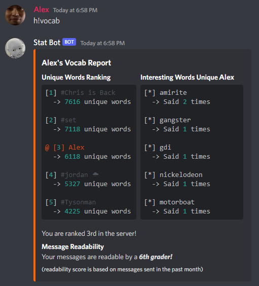

stat-bot [WIP]
================
Personal statistics Discord bot that collects messages from a server to show fun and interesting insights. This project 
is a work in progress.

This bot can create word clouds and analyze vocabulary of users using natural language processing. Using PostgreSQL, 
the bot will store all messages previously sent in the server. While running, the bot will also listen for new 
messages, messages edits, and deletions to update its database.

Commands
================
All commands must begin with the bot command prefix which can be set in the `core/bot_config.py` file. See Installation 
section for details. The prefix `h!` is used throughout this README as an example.
## msgcount
This command counts messages sent by a user in the server or a channel.

You can specify a user by @ mentioning them. Similarly, you can specify a channel by using a # channel mention. If 
unspecified, the bot will assume the command user as the target and the entire server as the scope.

<!-- -->
## wordcloud
This command generates word clouds based on messages sent by a user in the server or a channel.

You can specify a user by @ mentioning them. Similarly, you can specify a channel by using a # channel mention. If 
unspecified, the bot will assume the command user as the target and the entire server as the scope.

<!-- -->

The bot can also generate word clouds in the shape and color of images using image masks. Several pre-made masks are 
available and can be specified by adding it as an argument to the command.

Included mask arguments:
- burger
- cock
- dog
- egg
- frog
- koala
- ladybug
- minion
- monkey
- orangutan
- seal
- spaghetti
- sus

<!-- -->
<!-- -->

You can also attach your own custom images to be used. Images with transparent sections will not have text in the 
transparent areas. Images with no transparency will instead not have text in white areas. The background defaults to 
black, and currently there is no way for users to specify a different color. The bot will automatically increase the 
saturation on images to yield better results.

<!-- -->

### Additional arguments:
- noemojis

  By default, emoji names show up in the text messages the bot receives from Discord. This argument will tell the bot 
  to filter them out prior to generating the wordcloud.

- emojisonly

  This argument will filter out all words that are not Discord emojis. Fun for seeing your commonly used emojis.
## vocab
This command analyzes a user's vocabulary based on messages sent in the server or a channel and responds with a vocab 
report. The report for an individual user will contain 3 sections:
- Unique Words Ranking
  
  Number of unique words used as compared to other users.

- Interesting Words Unique to User

  Interesting words used by only one person. Five words are chosen randomly from a subset of the most interesting words.

- Message Readability

  Readability metric that measures the lowest grade level capable of reading the messages. Based on messages sent in
  the past month.

Valid unique words are determined by comparison to a 
[list of dictionary words](https://en.wikipedia.org/wiki/Words_(Unix)) and a list of words gathered from 
[Urban Dictionary.](https://www.kaggle.com/datasets/therohk/urban-dictionary-words-dataset) All other words are 
ignored. You will need to download the 
[Urban Dictionary](https://www.kaggle.com/datasets/therohk/urban-dictionary-words-dataset) dataset for this command to 
work. A word's "interesting-ness" is calculated based on how many times it is used in the server and how many upvotes 
and downvotes the Urban Dictionary entries have received.

You can specify a user by ID, @ mention, name#discrim, or just name. Names with spaces must be in quotes. Similarly, 
you can specify a channel by using an ID, # mention, or name. If unspecified, the bot will assume the command user as 
the target and the entire server as the scope.

<!-- -->

You can also specify an individual section such as `h!vocab ranking` to be shown instead of generating a full report.

Section arguments:
- `h!vocab ranking`
- `h!vocab unique`
- `h!vocab grade`

<!-- -->

This command can generate a report for the entire server without targeting a specific user by using the `server` 
subcommand. Note that you cannot pass users to this subcommand, only channels. 

The `server` subcommand includes an additional section "Interesting Words Said in Server" which shows a list of 
interesting words said in the server that aren't specifically unique to any user. Five words are chosen randomly from a 
subset of the most interesting words.

Same as the regular `vocab` command, you can specify a specific section instead of generating a full report.

Section arguments:
- `h!vocab ranking`
- `h!vocab unique`
- `h!vocab interesting`
- `h!vocab grade`

<!-- -->

## addguild

This command will begin the process of adding all pre-existing messages to the bot's database. It will also enable the 
bot to log new messages, edits, and deletions in this server.

## removeguild

This command will delete all messages from this server from its database. After this command is used, the bot will no 
longer log new messages, edits, and deletions.

To-Do
================
* [ ] Find a better name for this project so it doesn't conflict with an existing [Discord bot](https://statbot.net/)
* [ ] Refactor `wordcloud` and `msgcount` commands into subcommands and to use discord.py Converters. This will enable 
more methods of specifying user and channel targets such as in the `vocab` command.
* [ ] Rewrite commands to work with slash commands
* [ ] `trend` command to generate graphs/graphics of keyword usage similar to 
[Google Trends](https://trends.google.com/trends/?geo=US)
* [ ] Introduce command error handlers
* [ ] Introduce proper logging
* [ ] Add support in database schema for Discord threads
* [ ] Command cooldowns (per user & global)
* [ ] Checking for missed messages, edits, and deletions after bot downtime
* [ ] Docker image for ease-of-setup

Requirements
================

- Python 3.9
- Latest development version of discord.py using 
`python -m pip install -U git+https://github.com/Rapptz/discord.py`
- All modules in `requirements.txt`
- PostgreSQL server & PGAdmin 4

Installation
================

I will provide rudimentary directions on how to set this bot up for yourself, but please keep in mind that this project 
is still a work in progress and was not designed to be distributed for personal use. 

1. Clone the repo to your computer.
2. Download the 
[Urban Dictionary Dataset](https://www.kaggle.com/datasets/therohk/urban-dictionary-words-dataset) and place it into 
the `datasets` folder. Make sure it is still named `urbandict-word-defs.csv`.
3. Setup a PostgreSQL server and use the `sql/create_db.sql` script to generate the required schema.
4. Create [bot application](https://discord.com/developers/applications) on the Discord Developer portal.
5. Once your bot application is created, go to the Bot tab and enable the "Server Members Intent" and 
"Message Content Intent".

    <!-- -->

6. Invite the bot you just created to your server by going to the OAuth2 -> URL Generator tab.

   <!-- -->
   <!-- -->

    Make sure you check the "bot" scope and enabled at least the above permissions. Use the generated URL to add the 
    bot.

7. Fill out details such as your bot token and database credentials in the `core/bot_config_sample.py` sample file and 
rename it to `bot_config.py`.
8. Run the bot using `python main.py`.